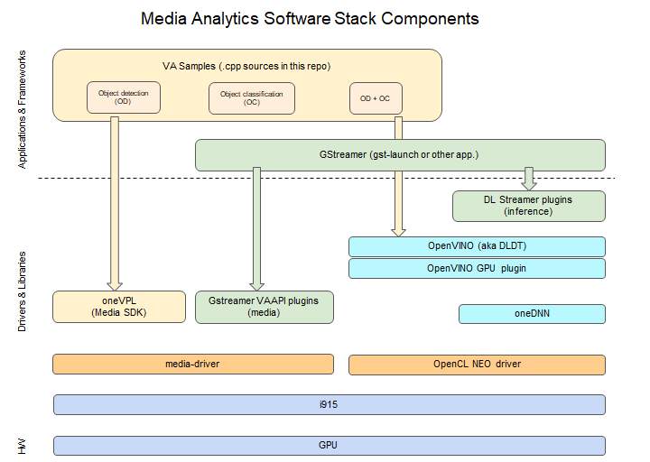
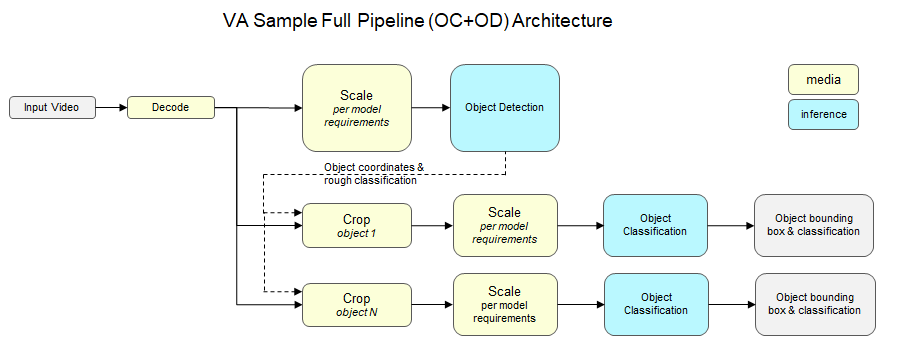
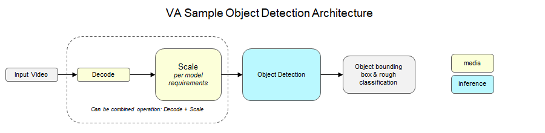
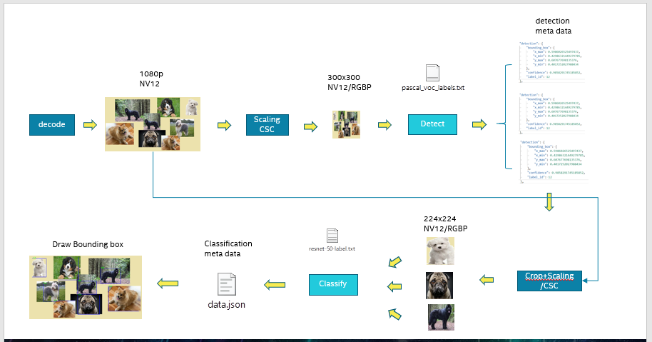
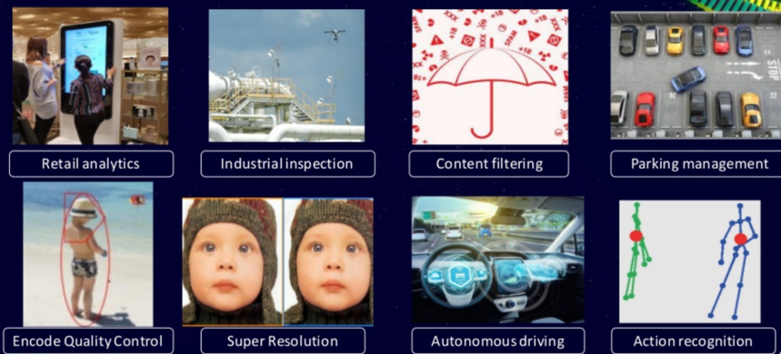

Media Analytics Software Stack
==============================

.. contents::

Overview
--------

This project provides samples to demonstrate the use of Intel GPU in
a simplified real-life scenarios involving media analytics. It leverages a
Software Stack which consists of the following ingredients:

* `OpenVINO Toolkit <https://github.com/openvinotoolkit/openvino>`_
* `GStreamer <https://github.com/openvinotoolkit/dlstreamer_gst>`_ plugins:

  * For OpenVINO: `DL Streamer <https://github.com/openvinotoolkit/dlstreamer_gst>`_
  * For media: `VAAPI plugins <https://github.com/GStreamer/gstreamer-vaapi>`_

* `Intel oneVPL <https://github.com/oneapi-src/oneVPL-intel-gpu>`_
* `Intel Media SDK <https://github.com/Intel-Media-SDK/MediaSDK>`_
* `Intel Media Driver <https://github.com/intel/media-driver>`_
* VA Samples (sources in this repo)

Provided samples focus on the key aspects of the proper Intel software setup
and integration with other popular tools you will likely use in your final product.
As a key aspect, they demonstrate how to connect media components to AI inference
and share video data efficiently without CPU involvement.

There are 2 groups of samples provided in this repo. One is focused on
GStreamer command line examples connecting media and inference elements. Another
on how to write your own C++ application with OpenVINO and oneVPL.

In these samples we focus on Object Detection + Object Classification pipelines
which use the following models:

* `ssd_mobilenet_v1_coco (INT8 quantized) <https://github.com/dlstreamer/pipeline-zoo-models/tree/main/storage/ssd_mobilenet_v1_coco_INT8>`_ - quantized from `ssd_mobilenet_v1_coco <https://github.com/openvinotoolkit/open_model_zoo/tree/master/models/public/ssd_mobilenet_v1_coco>`_
* `resnet-50-tf (INT8 quantized) <https://github.com/dlstreamer/pipeline-zoo-models/tree/main/storage/resnet-50-tf_INT8>`_ - quantized from `resnet-50-tf <https://github.com/openvinotoolkit/open_model_zoo/tree/master/models/public/resnet-50-tf>`_

See below architecture diagram for VA Sample.

Host requirements
-----------------

To run these samples, you need to:

1. Have a system with enabled Intel GPU card supported by (refer to respective
   component documentation for the list of supported GPUs):

   * Intel media driver (https://github.com/intel/media-driver)

   * Intel OpenCL driver (https://github.com/intel/compute-runtime)

2. Run Linux OS with up-to-date Linux kernel supporting underlying Intel GPU

3. Have installed and configured Docker version 17.05 or later (see `instructions <https://docs.docker.com/install/>`_)

**Coming soon**

Above drivers and Linux OSes might not currently support ATS-M Intel GPU cards.
Specific setup instructions for systems with these cards will be provided
as soons as they are available.

Input content requirements
--------------------------

These samples might use AVC or HEVC rough input video streams. Streams in container
formats (like .mp4) are not supported by VA Samples. Mind that GStreamer elements
to support such streams might not be included in docker images as well.

Please, make sure to select input video streams with the objects which AI models
are capable to recognize. Arbitrary input streams might not have such objects.
For the reference, we use the following models in our samples:

1. Object detection with SSD MobileNetV1:

   - Model used: SSD MobileNetV1
   - Default resolution: 300x300

2. Object detection with Yolov4:

   - Model used: Yolov4
   - Default resolution: 608x608
   - Recommended resolution: 416x416 (model supports dynamic reshape)

3. Object сlassification

   - Model used: Resnet50 v1.5
   - Default resolution 224x224

Mind that input video will be converted (scaled and/or color converted to nv12 or rgbp)
to satisfy inference model requirements highlighted above.

How to install?
---------------

**Hint:** to install a docker refer to Docker install
`instructions <https://docs.docker.com/install/>`_.

Samples are available in a form of `Docker <https://docker.com>`_ containers
which you need to build locally.

To build docker image with VA Samples, run::

  docker build \
    $(env | grep -E '(_proxy=|_PROXY)' | sed 's/^/--build-arg /') \
    --file docker/va-samples/ubuntu20.04/intel-gfx/Dockerfile \
    -t intel-va-samples \
    .

To build docker image with DL Streamer, run::

  docker build \
    $(env | grep -E '(_proxy=|_PROXY)' | sed 's/^/--build-arg /') \
    --file docker/gst-gva/ubuntu20.04/intel-gfx/Dockerfile \
    -t intel-gva-samples \
    .

Above docker files will self-build OpenVINO and DL Streamer and fetch binary packages
for media and compute stacks from `Intel Graphics Package Repository <https://dgpu-docs.intel.com/>`_.

Above dockerfiles are being generated from `m4 <https://www.gnu.org/software/m4/>`_
templates via `cmake <https://cmake.org/>`_ build system. Refer to
`generating dockerfiles <doc/docker.rst>`_ document for further details.

How to run?
-----------

VA Samples
^^^^^^^^^^

VA samples leverage Intel MediaSDK and OpenVino to run media analytics pipeline.

To run VA Samples enter container you've built allowing GPU access
from inside the container::

  DEVICE=${DEVICE:-/dev/dri/renderD128}
  DEVICE_GRP=$(ls -g $DEVICE | awk '{print $3}' | \
    xargs getent group | awk -F: '{print $3}')
  docker run --rm -it \
    -e DEVICE=$DEVICE --device $DEVICE --group-add $DEVICE_GRP \
    --cap-add SYS_ADMIN \
    intel-va-samples

The major artifact produced by samples is output.csv file with the following
format::

  channel#, frame#, object#, left, top, right, bottom, id, probability

where

* ``channel`` - inference channel number
* ``frame#`` - frame number starting from 1
* ``object#`` - number of the object detected on a frame
* ``left, top, right, bottom`` - coordinates of the detected object normalized by
  width/height
* ``id`` - classification id
* ``probability`` - probability with which object was classified

Object Detecton
~~~~~~~~~~~~~~~

Object detection can be executed with::

  ObjectDetection -c 1 -d -t 5 \
    -codec 264 -i /opt/data/embedded/pexels-1388365.h264 \
    -m_detect $DEMO_MODELS/ssd_mobilenet_v1_coco_INT8/ssd_mobilenet_v1_coco

Example of output.csv file::

  $ cat output.csv | head -10
  0, 1, 0, 0.002710, 0.538312, 0.281266, 0.924779, 3, 0.920898
  0, 1, 1, 0.889920, 0.329635, 0.934364, 0.382974, 10, 0.903809
  0, 1, 2, 0.766202, 0.336393, 0.796227, 0.377465, 10, 0.833984
  0, 2, 0, 0.003211, 0.538931, 0.284941, 0.923290, 3, 0.932617
  0, 2, 1, 0.890183, 0.327957, 0.934696, 0.380550, 10, 0.904785
  0, 2, 2, 0.767770, 0.336121, 0.796690, 0.377289, 10, 0.844727
  0, 3, 0, 0.003667, 0.539677, 0.288079, 0.924863, 3, 0.939453
  0, 3, 1, 0.890039, 0.327210, 0.934449, 0.380946, 10, 0.916016
  0, 3, 2, 0.769145, 0.334644, 0.797796, 0.374019, 10, 0.857422
  0, 4, 0, 0.003526, 0.543937, 0.292021, 0.921377, 3, 0.928223

For detailed command line options see `man ObjectDetection <doc/man/ObjectDetection.asciidoc>`_.

Object Detection and Classification
~~~~~~~~~~~~~~~~~~~~~~~~~~~~~~~~~~~

End to end pipeline can be executed with::

  SamplePipeline -c 1 -b 1 \
    -codec 264 -i /opt/data/embedded/pexels-1388365.h264 \
    -m_classify $DEMO_MODELS/resnet-50-tf_INT8/resnet-50-tf_i8 \
    -m_detect $DEMO_MODELS/ssd_mobilenet_v1_coco_INT8/ssd_mobilenet_v1_coco

If frame  has multiple objects each one is classified seperately.
Example of output.csv file::

  $ cat output.csv | head -10
  0, 1, 0, 0.002710, 0.538312, 0.281266, 0.924779, 657, 0.252905
  0, 1, 1, 0.889920, 0.329635, 0.934364, 0.382974, 921, 0.696968
  0, 1, 2, 0.766202, 0.336393, 0.796227, 0.377465, 921, 0.390088
  0, 2, 0, 0.003211, 0.538931, 0.284941, 0.923290, 437, 0.278607
  0, 2, 1, 0.890183, 0.327957, 0.934696, 0.380550, 921, 0.398567
  0, 2, 2, 0.767770, 0.336121, 0.796690, 0.377289, 921, 0.509662
  0, 3, 0, 0.003667, 0.539677, 0.288079, 0.924863, 657, 0.354671
  0, 3, 1, 0.890039, 0.327210, 0.934449, 0.380946, 921, 0.351903
  0, 3, 2, 0.769145, 0.334644, 0.797796, 0.374019, 921, 0.531966
  0, 4, 0, 0.003526, 0.543937, 0.292021, 0.921377, 657, 0.251537

For detailed command line options see `man SamplePipeline <doc/man/SamplePipeline.asciidoc>`_.

DL Streamer
^^^^^^^^^^^

DL Streamer is a streaming media analytics framework, based on GStreamer multimedia framework,
for creating complex media analytic pipelines. It ensures pipeline interoperability and provides optimized media,
and inference operations using Intel® Distribution of OpenVINO™ Toolkit Inference Engine backend.

To run DL Streamer samples enter container you've built allowing GPU access
from inside the container::

  DEVICE=${DEVICE:-/dev/dri/renderD128}
  DEVICE_GRP=$(ls -g $DEVICE | awk '{print $3}' | \
    xargs getent group | awk -F: '{print $3}')
  docker run --rm -it \
    -e DEVICE=$DEVICE --device $DEVICE --group-add $DEVICE_GRP \
    --cap-add SYS_ADMIN \
    intel-gva-samples

Object Detecton
~~~~~~~~~~~~~~~

Object detection can be executed with::

  gst-launch-1.0 \
    filesrc location=/opt/data/embedded/pexels-1388365.h264 ! \
    h264parse ! \
    vaapih264dec ! \
    gvadetect model=$DEMO_MODELS/ssd_mobilenet_v1_coco_INT8/ssd_mobilenet_v1_coco.xml \
    device=GPU ! \
    gvafpscounter ! \
    fakesink async=false

Object Detection and Classification
~~~~~~~~~~~~~~~~~~~~~~~~~~~~~~~~~~~

Complex pipeline can be executed with::

  gst-launch-1.0 \
    filesrc location=/opt/data/embedded/pexels-1388365.h264 ! \
    h264parse ! \
    vaapih264dec ! \
    gvadetect model=$DEMO_MODELS/ssd_mobilenet_v1_coco_INT8/ssd_mobilenet_v1_coco.xml \
    device=GPU ! \
    queue ! \
    gvaclassify model=$DEMO_MODELS/resnet-50-tf_INT8/resnet-50-tf_i8.xml \
    device=GPU ! \
    gvafpscounter ! \
    fakesink async=false

DL Streamer elements
~~~~~~~~~~~~~~~~~~~~

DL Streamer includes inference elements as well as some helper ones. Please refer to the official
`documentation <https://github.com/openvinotoolkit/dlstreamer_gst/wiki/Elements>`_ for more info.

You can use next command to get help about a GStreamer plugin::

  gst-inspect-1.0 <element_name>

Here is a brief description of some of the elements.

* **gvainference** - performs inference using provided model and passes raw results down the pipeline.
* **gvadetect** - performs object detection using provided model.
* **gvaclassify** - performs object classification using provided model.
* **gvafpscounter** - measures frames per second and outputs result to console.
* **gvametaconvert** and **gvametapublish** - can be used to publish metadata (inference results) produced
  by samples to an output file.
* **gvapython** - allows user to execute custom Python code on GStreamer buffers and attached to them metadata.

Example of complex DL Streamer pipeline::

  gst-launch-1.0 \
    filesrc location=/opt/data/embedded/pexels-1388365.h264 ! \
    h264parse ! \
    vaapih264dec ! \
    gvadetect model=$DEMO_MODELS/ssd_mobilenet_v1_coco_INT8/ssd_mobilenet_v1_coco.xml device=GPU ! \
    queue ! \
    gvaclassify model=$DEMO_MODELS/resnet-50-tf_INT8/resnet-50-tf_i8.xml device=GPU ! \
    gvafpscounter ! \
    gvametaconvert format=json json-indent=2 ! \
    gvametapublish file-path=/opt/data/artifacts/out.json ! \
    fakesink async=false

Analytics architecture/solutions
--------------------------------

Media Analytic pipeline is composed of media + inference components connected in generic sense as shown in figure below.

The solution pipeline can easily be tailored to shape in different use case by changing inference components with different AI models.
For example, pipeline can be used for pure classification, face recognition, smart city, VMC Summarization and other use cases
as shown in figure below

Further reading
---------------

* `Manual Pages <doc/man/readme.rst>`_

* `Generating Dockerfiles <doc/docker.rst>`_
* `HowTo <doc/howto.rst>`_
* `Tests <tests/readme.rst>`_

* `Intel Media SDK <https://github.com/Intel-Media-SDK/MediaSDK>`_
* `Intel Media Driver <https://github.com/intel/media-driver>`_
* `Openvino <https://github.com/openvinotoolkit/openvino>`_
* `Openvino Open Model Zoo <https://github.com/openvinotoolkit/open_model_zoo>`_  
* `Open Visual Cloud <https://01.org/openvisualcloud>`_

  * `Smart City Sample <https://github.com/OpenVisualCloud/Smart-City-Sample>`_

* `DL Streamer <https://github.com/openvinotoolkit/dlstreamer_gst>`_
* `Docker <https://docker.com>`_

Other samples:

* `Media Delivery Software Stack <https://github.com/intel/media-delivery>`_

